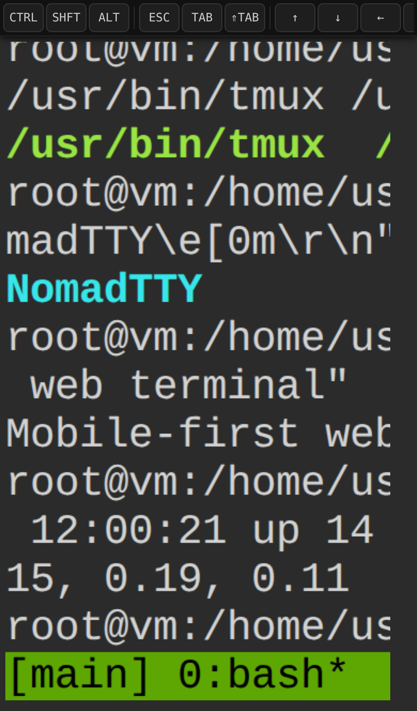
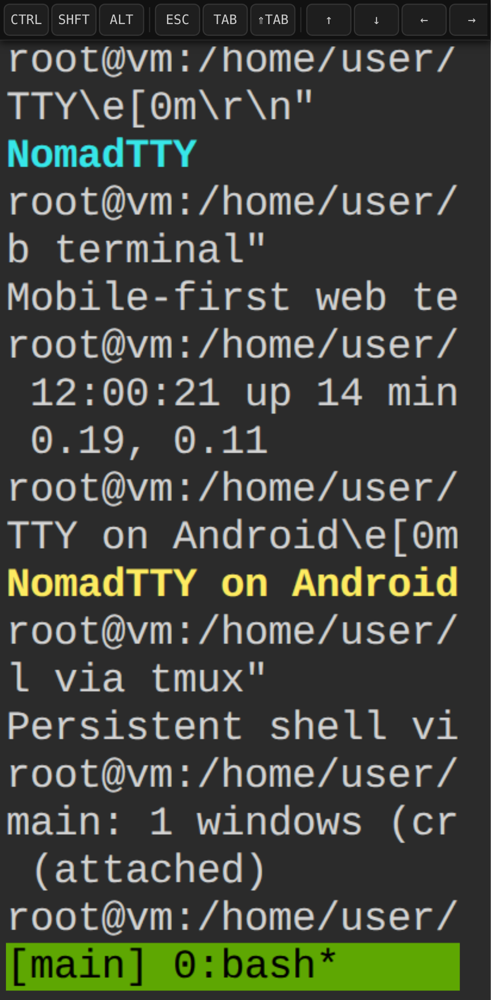
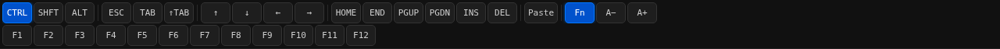
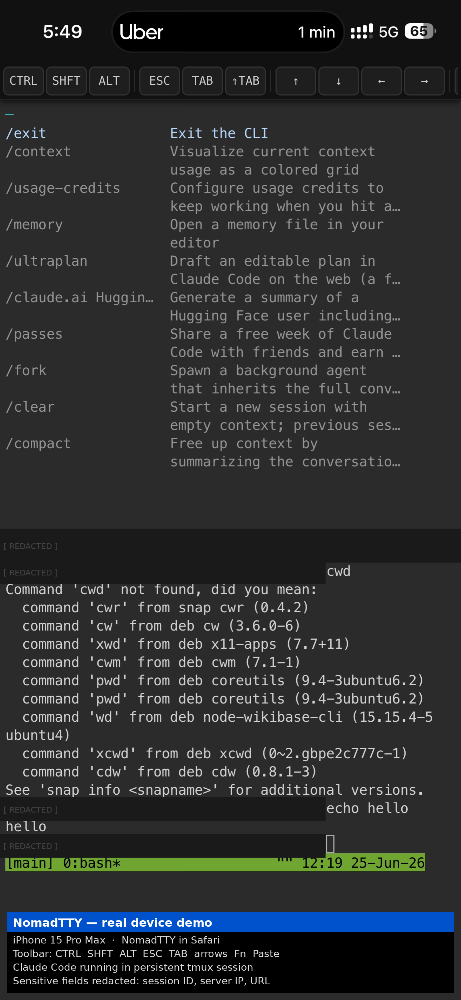
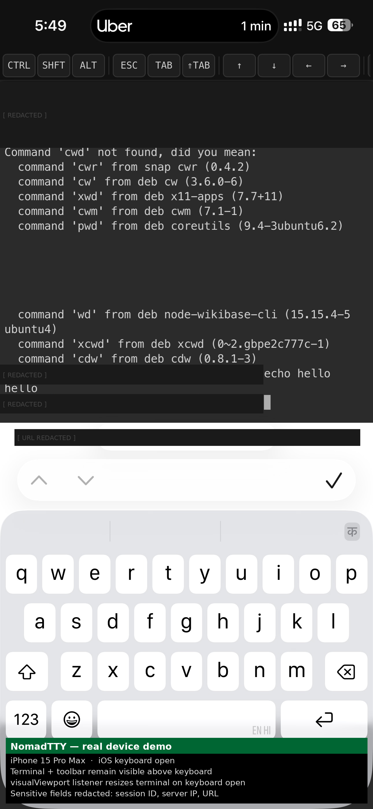
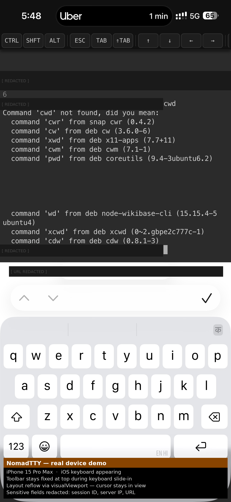
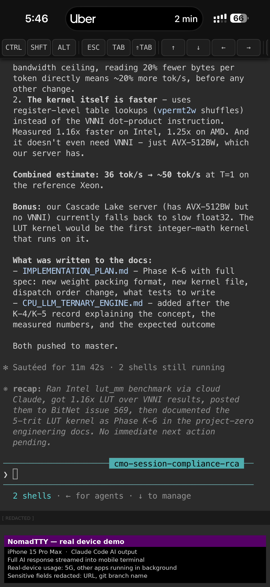
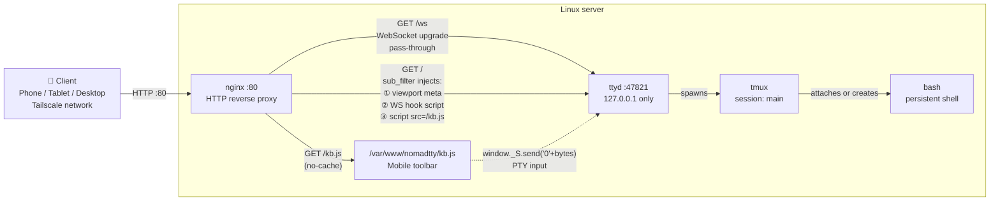

# NomadTTY

[](https://github.com/shifulegend/nomadtty/actions/workflows/ci.yml)
[](LICENSE)
[](https://ghcr.io/shifulegend/nomadtty)

**A mobile-friendly web terminal you can access from anywhere.**

NomadTTY wraps [ttyd] with a purpose-built mobile keyboard toolbar — giving you ESC,
TAB, arrow keys, modifier keys (Ctrl/Shift/Alt), F1–F12, and more, all from a phone or
tablet browser. Sessions are persistent via [tmux], so closing your browser never kills
your work.

[ttyd]: https://github.com/tsl0922/ttyd
[tmux]: https://github.com/tmux/tmux

---

## Demo

### Mobile — sticky CTRL modifier and Fn row (iPhone 14 viewport)


### Desktop (1280 × 720)


### Side-by-side device screenshots

| iPhone 14 | Pixel 7 (Android) |
|:---------:|:-----------------:|
|  |  |

### Toolbar — CTRL active (blue) + F-key row expanded



> **How these were captured:** Playwright device emulation (Chromium headless) at iPhone 14
> (390 × 844) and Pixel 7 (412 × 915) viewports against a live ttyd + nginx stack.
> Video recorded with `context.recordVideo`, converted to GIF with ffmpeg palette method.
> See [`scripts/capture-demo.mjs`](scripts/capture-demo.mjs) to reproduce.

### iPhone 15 Pro Max

Captured over 5G. Sensitive fields (server IP, session ID, URL, branch name) are redacted.

| Toolbar + Claude Code help | iOS keyboard open |
|:--------------------------:|:-----------------:|
|  |  |

| Keyboard appearing | Claude Code AI output |
|:------------------:|:---------------------:|
|  |  |

---

## Features

- **Mobile-first toolbar** — tap CTRL, SHFT, or ALT to activate sticky modifiers, then
  type on your phone keyboard to send `Ctrl+C`, `Alt+B`, etc.
- **Full navigation keys** — ESC, TAB, Shift+TAB, ↑↓←→, HOME, END, PGUP, PGDN, INS, DEL
- **F1–F12** via Fn toggle row
- **Modifier combinations** — CTRL+SHFT, CTRL+ALT, ALT+SHFT and all three together
- **Pinch-to-zoom safe** — `touch-action: pan-y` prevents accidental iOS zoom
- **Mobile keyboard aware** — `visualViewport` listener resizes the terminal when the
  on-screen keyboard appears or disappears
- **Touch scroll** — finger swipe scrolls tmux scrollback on iOS and Android
- **Paste button** — clipboard API on HTTPS; fallback textarea overlay on HTTP
- **Responsive font** — 14 px desktop → 13 px tablet → 12 px phone
- **Persistent sessions** — tmux keeps your session alive across disconnects and
  browser closes
- **Zero JavaScript dependencies** — pure vanilla JS, ~9 KB, injected via nginx
  `sub_filter`

---

## Quick Install (Debian / Ubuntu) — one command

```bash
curl -fsSL https://raw.githubusercontent.com/shifulegend/nomadtty/main/install.sh | sudo bash
```

The installer automatically:
1. Installs `ttyd`, `tmux`, `nginx`, `curl` via apt
2. Downloads `kb.js` to `/var/www/nomadtty/`
3. Installs and enables the nginx vhost (port 80)
4. Installs and starts the `ttyd` systemd service (persists across reboots)
5. Runs a health check — prints `HTTP 200 OK` if everything is working
6. Prints the URL to open in your browser

At the end you will see:

```
✓  NomadTTY installed and running.

   Open:  http://192.168.1.x
```

### Configuration options

All options are env vars — no config file to edit:

| Variable | Default | Description |
|----------|---------|-------------|
| `NOMADTTY_HOST` | _(any)_ | Set your domain as nginx `server_name`, e.g. `terminal.example.com` |
| `TTYD_PORT` | `47821` | Internal ttyd listen port (loopback only, not publicly exposed) |
| `NOMADTTY_USER` | current sudo user | OS user that runs ttyd — must own the tools you want available in the shell |

**With a custom domain:**

```bash
curl -fsSL https://raw.githubusercontent.com/shifulegend/nomadtty/main/install.sh \
  | sudo NOMADTTY_HOST=terminal.example.com bash
```

**With a custom port and user:**

```bash
curl -fsSL https://raw.githubusercontent.com/shifulegend/nomadtty/main/install.sh \
  | sudo TTYD_PORT=9000 NOMADTTY_USER=ubuntu bash
```

### Uninstall

The installer prints exact uninstall commands at the end. In short:

```bash
sudo systemctl disable --now ttyd
sudo rm -f /etc/systemd/system/ttyd.service \
           /etc/nginx/sites-available/nomadtty \
           /etc/nginx/sites-enabled/nomadtty
sudo rm -rf /var/www/nomadtty
sudo systemctl daemon-reload && sudo systemctl reload nginx
```

### Troubleshoot

```bash
# Is ttyd running?
systemctl status ttyd

# Is nginx config valid?
sudo nginx -t

# Live logs
journalctl -u ttyd -f
tail -f /var/log/nginx/nomadtty.access.log

# Is the toolbar being injected?
curl -s http://localhost/ | grep 'kb.js'
```

---

## Docker

### Run pre-built image (amd64 / arm64)

```bash
docker run -d -p 80:80 --name nomadtty ghcr.io/shifulegend/nomadtty:latest
```

Then open `http://localhost` in your browser.

### Build locally

```bash
git clone https://github.com/shifulegend/nomadtty.git
cd nomadtty
docker compose up -d
```

### Multi-arch build

```bash
docker buildx build \
  --platform linux/amd64,linux/arm64 \
  -t ghcr.io/shifulegend/nomadtty:latest \
  --push .
```

---

## Manual Install

### 1 — Install dependencies

```bash
sudo apt-get install -y ttyd tmux nginx
```

### 2 — Deploy the toolbar

```bash
sudo mkdir -p /var/www/nomadtty
sudo cp src/kb.js /var/www/nomadtty/kb.js
```

### 3 — Configure nginx

```bash
sudo cp nginx/ttyd.conf /etc/nginx/sites-available/nomadtty
# Edit server_name to match your domain:
sudo nano /etc/nginx/sites-available/nomadtty
sudo ln -sf /etc/nginx/sites-available/nomadtty /etc/nginx/sites-enabled/
sudo nginx -t && sudo systemctl reload nginx
```

### 4 — Start ttyd as a service

```bash
sudo cp systemd/ttyd.service /etc/systemd/system/
sudo systemctl daemon-reload
sudo systemctl enable --now ttyd
```

---

## Architecture



### How the injection works

nginx's `sub_filter` rewrites ttyd's `<head>` on the fly before the HTML reaches the
browser. Three items are injected in a single pass:

1. **Viewport meta tag** — mobile scaling, prevents iOS double-tap zoom, triggers
   keyboard-resize-content on Android.
2. **Inline WebSocket hook** (`< 300 B`) — overrides `window.WebSocket` before ttyd's
   bundle loads. Stores the `/ws` connection as `window._S` so `kb.js` can send PTY
   bytes without modifying ttyd's source.
3. **`<script src="/kb.js" defer>`** — loads the full toolbar after the DOM is parsed.

The toolbar then lives entirely in `src/kb.js`: a single self-contained IIFE with no
dependencies, no build step, and no bundler.

---

## The VirtualKeyBar

Executing complex terminal commands on mobile devices is painful because software
keyboards lack essential modifier keys. NomadTTY's toolbar solves this with
**sticky modifier keys**.

To send a `SIGINT` (`Ctrl+C`):

1. Tap **CTRL** — the button highlights blue and latches active.
2. Type `C` on your phone keyboard.

The toolbar intercepts the keydown event, calculates the correct ASCII control byte,
and transmits it to the PTY:

```javascript
// Physical keydown interceptor in src/kb.js
document.addEventListener('keydown', function (ev) {
  if (!M.c && !M.s && !M.a) return;   // no modifier active — pass through
  var k = ev.key;
  ev.preventDefault();
  if (M.c && k.length === 1) {
    var code = k.toUpperCase().charCodeAt(0) - 64;  // 'C' → 67 − 64 = 3
    if (code > 0 && code < 32) send(String.fromCharCode(code));  // sends \x03
  }
  resetMods();
}, true);
```

The same mechanism handles ALT (sends ESC prefix) and SHIFT (uppercases), and all
three can be active simultaneously for combinations like `Ctrl+Shift+Up`.

---

## Security Posture

NomadTTY is designed for **private network deployment**, not public internet exposure.

| Layer | Mechanism |
|-------|-----------|
| **ttyd isolation** | Binds to `127.0.0.1:47821` only — unreachable from outside the server |
| **nginx as gateway** | The only public-facing process; enforces TLS, rate limits, auth |
| **No built-in auth** | Your responsibility — Tailscale VPN is the recommended approach |
| **Non-root service** | ttyd runs as the deploy user, not root |
| **Sub-filter injection** | Inline hook is < 300 B; full toolbar in external `kb.js` |
| **Dependabot scanning** | Automated CVE checks on Docker base and GitHub Actions pins |

**Recommended deployment:** put NomadTTY behind [Tailscale](https://tailscale.com) so
the terminal is never reachable from the public internet. Tailscale Serve adds
automatic HTTPS on your `ts.net` domain.

See [SECURITY.md](SECURITY.md) for the full hardening checklist and vulnerability
disclosure process.

---

## Keyboard Toolbar Reference

| Key | What it sends |
|-----|--------------|
| **CTRL** | Sticky modifier — tap then press a letter for Ctrl+letter |
| **SHFT** | Sticky shift modifier |
| **ALT** | Sticky alt modifier — sends ESC prefix |
| **ESC** | `\x1b` |
| **TAB** | `\t` |
| **⇑TAB** | Shift+Tab `\x1b[Z` |
| **↑↓←→** | Arrow keys (with modifier support: Ctrl+↑, Shift+↑, etc.) |
| **HOME / END** | `\x1b[H` / `\x1b[F` |
| **PGUP / PGDN** | `\x1b[5~` / `\x1b[6~` |
| **INS / DEL** | `\x1b[2~` / `\x1b[3~` |
| **Paste** | Clipboard API (HTTPS) or overlay textarea (HTTP) |
| **Fn** | Toggle F1–F12 row |
| **F1–F12** | Standard xterm sequences |
| **A− / A+** | Zoom terminal text in/out |

---

## Tailscale Setup

To expose NomadTTY only on your Tailscale network (no public internet):

```bash
# Option 1: Tailscale Serve — automatic HTTPS on your ts.net domain
tailscale serve --bg http://localhost:80

# Option 2: Point a DNS record at your Tailscale IP and set server_name
NOMADTTY_HOST=terminal.yourdomain.com sudo -E bash -c \
  'curl -fsSL https://raw.githubusercontent.com/shifulegend/nomadtty/main/install.sh | bash'
```

---

## Contributing

See [CONTRIBUTING.md](CONTRIBUTING.md) for coding standards, branch naming
conventions, and pull request requirements.

Security issues go through [SECURITY.md](SECURITY.md) — please use private advisories,
not public issues.

For help, see [SUPPORT.md](SUPPORT.md).

---

## License

NomadTTY itself is MIT licensed. See [LICENSE](LICENSE).

Third-party components (ttyd, xterm.js, tmux, nginx) are credited in [NOTICE](NOTICE).
