# NomadTTY

[](https://github.com/shifulegend/nomadtty/actions/workflows/ci.yml)
[](LICENSE)
[](https://ghcr.io/shifulegend/nomadtty)

**A mobile-friendly web terminal you can access from anywhere.**

NomadTTY wraps [ttyd] with a purpose-built mobile keyboard toolbar — giving you ESC,
TAB, arrow keys, modifier keys (Ctrl/Shift/Alt), F1–F12, and more, all from a phone or
tablet browser. Sessions are persistent via [tmux], so closing your browser never kills
your work.

[ttyd]: https://github.com/tsl0922/ttyd
[tmux]: https://github.com/tmux/tmux

---

## Demo

### Desktop (1280 × 720)


### Toolbar — CTRL active (blue) + F-key row expanded

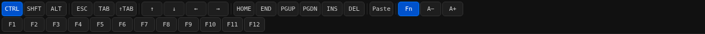

### iPhone 15 Pro Max

Captured over 5G. Sensitive fields (server IP, session ID, URL, branch name) are redacted.

| Toolbar + Claude Code help | iOS keyboard open |
|:--------------------------:|:-----------------:|
| 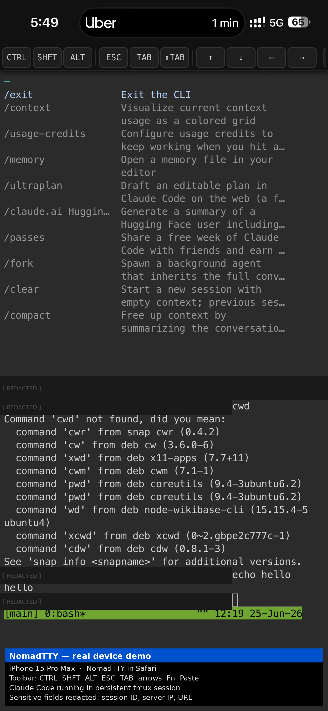 | 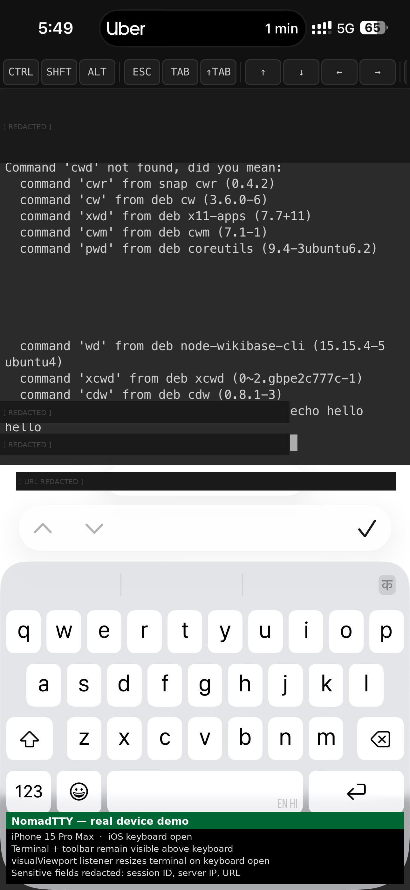 |

| Keyboard appearing | Claude Code AI output |
|:------------------:|:---------------------:|
| 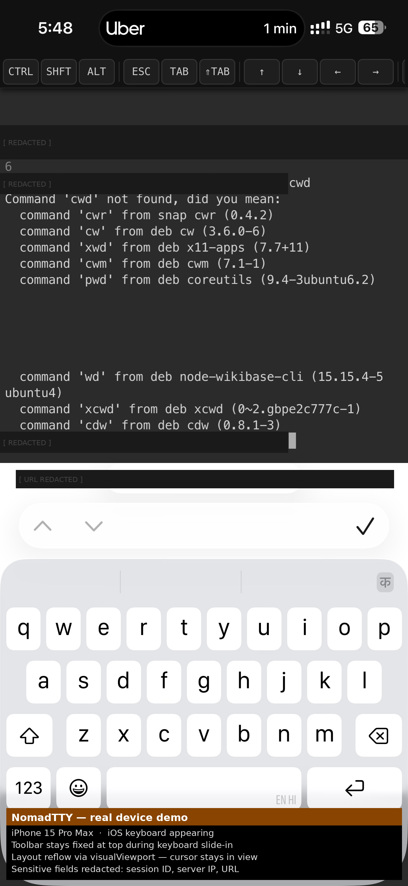 | 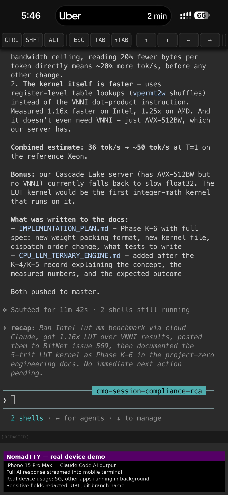 |

---

## Features

- **Mobile-first toolbar** — tap CTRL, SHFT, or ALT to activate sticky modifiers, then
  type on your phone keyboard to send `Ctrl+C`, `Alt+B`, etc.
- **Full navigation keys** — ESC, TAB, Shift+TAB, ↑↓←→, HOME, END, PGUP, PGDN, INS, DEL
- **F1–F12** via Fn toggle row
- **Modifier combinations** — CTRL+SHFT, CTRL+ALT, ALT+SHFT and all three together
- **Pinch-to-zoom safe** — `touch-action: pan-y` prevents accidental iOS zoom
- **Mobile keyboard aware** — `visualViewport` listener resizes the terminal when the
  on-screen keyboard appears or disappears
- **Touch scroll** — finger swipe scrolls tmux scrollback on iOS and Android
- **Paste button** — clipboard API on HTTPS; fallback textarea overlay on HTTP
- **Responsive font** — 14 px desktop → 13 px tablet → 12 px phone
- **Persistent sessions** — tmux keeps your session alive across disconnects and
  browser closes
- **Zero JavaScript dependencies** — pure vanilla JS, ~9 KB, injected via nginx
  `sub_filter`

---

## Quick Install (Debian / Ubuntu) — one command

```bash
curl -fsSL https://raw.githubusercontent.com/shifulegend/nomadtty/main/install.sh | sudo bash
```

The installer automatically:
1. Installs `ttyd`, `tmux`, `nginx`, `curl` via apt
2. Downloads `kb.js` to `/var/www/nomadtty/`
3. Installs and enables the nginx vhost (port 80)
4. Installs and starts the `ttyd` systemd service (persists across reboots)
5. Runs a health check — prints `HTTP 200 OK` if everything is working
6. Prints the URL to open in your browser

At the end you will see:

```
✓  NomadTTY installed and running.

   Open:  http://192.168.1.x
```

### Configuration options

All options are env vars — no config file to edit:

| Variable | Default | Description |
|----------|---------|-------------|
| `NOMADTTY_HOST` | _(any)_ | Set your domain as nginx `server_name`, e.g. `terminal.example.com` |
| `TTYD_PORT` | `47821` | Internal ttyd listen port (loopback only, not publicly exposed) |
| `NOMADTTY_USER` | current sudo user | OS user that runs ttyd — must own the tools you want available in the shell |

**With a custom domain:**

```bash
curl -fsSL https://raw.githubusercontent.com/shifulegend/nomadtty/main/install.sh \
  | sudo NOMADTTY_HOST=terminal.example.com bash
```

**With a custom port and user:**

```bash
curl -fsSL https://raw.githubusercontent.com/shifulegend/nomadtty/main/install.sh \
  | sudo TTYD_PORT=9000 NOMADTTY_USER=ubuntu bash
```

### Uninstall

The installer prints exact uninstall commands at the end. In short:

```bash
sudo systemctl disable --now ttyd
sudo rm -f /etc/systemd/system/ttyd.service \
           /etc/nginx/sites-available/nomadtty \
           /etc/nginx/sites-enabled/nomadtty
sudo rm -rf /var/www/nomadtty
sudo systemctl daemon-reload && sudo systemctl reload nginx
```

### Troubleshoot

```bash
# Is ttyd running?
systemctl status ttyd

# Is nginx config valid?
sudo nginx -t

# Live logs
journalctl -u ttyd -f
tail -f /var/log/nginx/nomadtty.access.log

# Is the toolbar being injected?
curl -s http://localhost/ | grep 'kb.js'
```

---

## Docker

### Run pre-built image (amd64 / arm64)

```bash
docker run -d -p 80:80 --name nomadtty ghcr.io/shifulegend/nomadtty:latest
```

Then open `http://localhost` in your browser.

### Build locally

```bash
git clone https://github.com/shifulegend/nomadtty.git
cd nomadtty
docker compose up -d
```

### Multi-arch build

```bash
docker buildx build \
  --platform linux/amd64,linux/arm64 \
  -t ghcr.io/shifulegend/nomadtty:latest \
  --push .
```

---

## Manual Install

### 1 — Install dependencies

```bash
sudo apt-get install -y ttyd tmux nginx
```

### 2 — Deploy the toolbar

```bash
sudo mkdir -p /var/www/nomadtty
sudo cp src/kb.js /var/www/nomadtty/kb.js
```

### 3 — Configure nginx

```bash
sudo cp nginx/ttyd.conf /etc/nginx/sites-available/nomadtty
# Edit server_name to match your domain:
sudo nano /etc/nginx/sites-available/nomadtty
sudo ln -sf /etc/nginx/sites-available/nomadtty /etc/nginx/sites-enabled/
sudo nginx -t && sudo systemctl reload nginx
```

### 4 — Start ttyd as a service

```bash
sudo cp systemd/ttyd.service /etc/systemd/system/
sudo systemctl daemon-reload
sudo systemctl enable --now ttyd
```

---

## Architecture

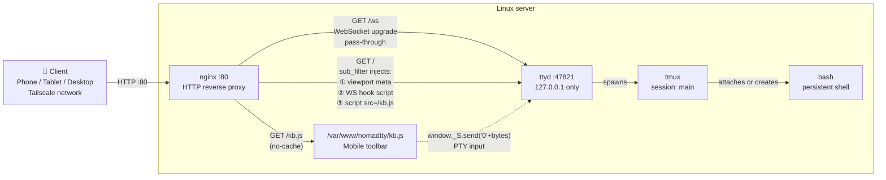
```mermaid
graph LR
    Client["📱 Client\nPhone / Tablet / Desktop\nTailscale network"]

    subgraph server ["Linux server"]
        Nginx["nginx :80\nHTTP reverse proxy"]
        KbJs["/var/www/nomadtty/kb.js\nMobile toolbar"]
        TTYD["ttyd :47821\n127.0.0.1 only"]
        TMUX["tmux\nsession: main"]
        Bash["bash\npersistent shell"]
    end

    Client -- "HTTP :80" --> Nginx
    Nginx -- "GET /kb.js\n(no-cache)" --> KbJs
    Nginx -- "GET /ws\nWebSocket upgrade\npass-through" --> TTYD
    Nginx -- "GET /\nsub_filter injects:\n① viewport meta\n② WS hook script\n③ script src=/kb.js" --> TTYD
    TTYD -- "spawns" --> TMUX
    TMUX -- "attaches or creates" --> Bash
    KbJs -. "window._S.send('0'+bytes)\nPTY input" .-> TTYD
```

### How the injection works

nginx's `sub_filter` rewrites ttyd's `<head>` on the fly before the HTML reaches the
browser. Three items are injected in a single pass:

1. **Viewport meta tag** — mobile scaling, prevents iOS double-tap zoom, triggers
   keyboard-resize-content on Android.
2. **Inline WebSocket hook** (`< 300 B`) — overrides `window.WebSocket` before ttyd's
   bundle loads. Stores the `/ws` connection as `window._S` so `kb.js` can send PTY
   bytes without modifying ttyd's source.
3. **`<script src="/kb.js" defer>`** — loads the full toolbar after the DOM is parsed.

The toolbar then lives entirely in `src/kb.js`: a single self-contained IIFE with no
dependencies, no build step, and no bundler.

---

## Session Manager & MCP Server

> **Note:** this is a separate, newer Node.js backend (`server/**`) alongside the
> nginx/ttyd setup above. It supports multiple concurrent named terminal sessions and
> exposes them to AI agents over MCP. It is not yet wired into `Dockerfile`/`install.sh`
> — run it directly with Node. (This is a known, tracked gap — see
> `docs/ai/project-overview.md`'s current-state note — not an oversight in this doc.)

This backend is governed by the same [`AGENTS.md`](AGENTS.md) constraints as the rest
of the repo. Two are worth calling out explicitly here since it's easy to assume
otherwise once an MCP server is LAN-reachable: **every ttyd process the Session
Manager spawns still listens on `127.0.0.1` only and still runs with `--writable`** —
exactly like the legacy nginx model above. Nothing about adding MCP support changes
that. What *is* new is a second, separate listener (the MCP server) that is
LAN-facing by default and gated by its own bearer-token authentication — see
[Security model](#security-model) below.

### Architecture

```
                node server/main.js  (one process, two listeners)
                ├── Session Manager   127.0.0.1:4000   (UI/API, no auth — loopback only)
                │     ├─ GET  /                        Session Manager UI (screenshot below)
                │     ├─ */api/sessions[/:id]           create / list / close
                │     ├─ GET  /kb.js                    mobile toolbar (shared with the legacy model)
                │     └─ *    /term/:id/*               reverse proxy → that session's ttyd (HTTP+WS)
                │
                └── MCP server        0.0.0.0:4200      (Streamable HTTP, bearer-token auth REQUIRED)
                      └─ POST/GET/DELETE /mcp           JSON-RPC + SSE, 7 terminal-control tools

Both share ONE in-memory session registry directly (same process, no network hop).
Creating a session runs, in order:
  1. tmux new-session -d -s <id>                         (created eagerly — MCP tools work
                                                            immediately, no browser required)
  2. ttyd --port <p> --interface 127.0.0.1 --writable \
          --client-option rendererType=dom \
          --base-path /term/<id>/ tmux new-session -A -s <id>   (attaches to the session from step 1)
```

MCP tools act on the tmux session directly (`tmux capture-pane` / `send-keys` /
`display-message`) — independent of ttyd's WebSocket — so an agent can drive a
terminal with no human ever opening a browser tab.

### Session Manager features

The Session Manager UI is a small, dependency-free page (`public/session-manager.*`)
in the same monospace/dark design language as the toolbar (see `DESIGN.md`):

- **Multiple concurrent named sessions.** Create as many terminals as you want, each
  with its own label; they all keep running in the background.
- **True persistence.** Closing a browser tab (or navigating back to the list) does
  *not* end the session — only the explicit **Close** button does. Under the hood
  that's tmux: the shell and its scrollback live in the tmux session, not the
  browser tab, so re-**Join**ing reattaches to the exact same state.
- **Live status.** The list polls `/api/sessions` every 5s and shows each session's
  status and last-joined time, with no manual refresh needed.
- **A Back button overlaid on the terminal itself** (`#back-btn`, injected by
  `src/kb.js`), so leaving a session to go create or join another one is a single
  tap — it never touches `#terminal-container`'s layout or fires a spurious resize
  (see `DESIGN.md`).

| Session Manager list (mobile) | Terminal view + Back button (mobile) |
|---|---|
| 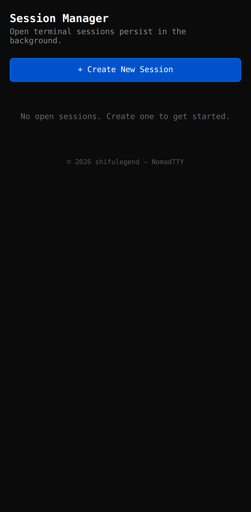 | 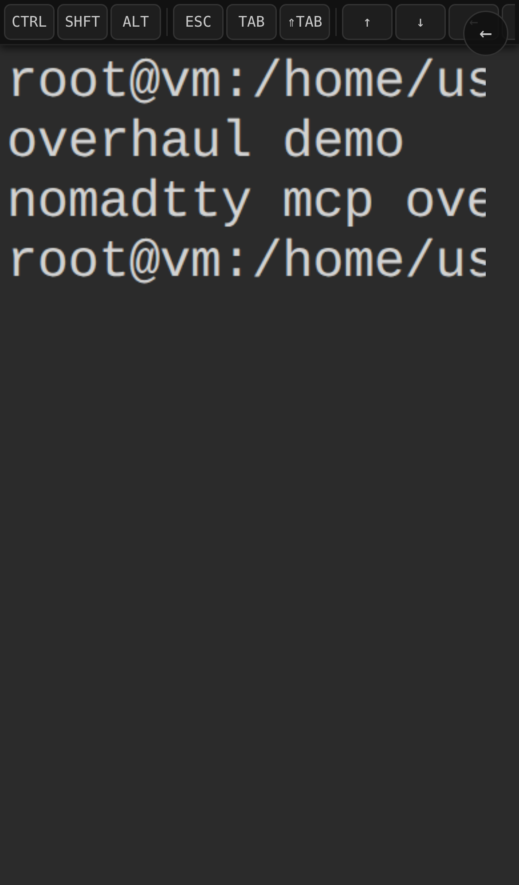 |

### Rigorous mobile UX validation

Mobile rendering and UX is validated against a real Android device profile —
Playwright's `devices['Pixel 7']` emulation (real 412×915 viewport,
`devicePixelRatio=2.625`, touch input, mobile user-agent) — rather than a full
Android emulator (AVD). A real AVD was evaluated and rejected for this
environment: there's no `/dev/kvm` and no hardware-virtualization CPU flags
available, so an AVD would fall back to slow, software-emulated QEMU — the
exact "heavy GUI overhead that crashes headless CI environments" failure mode
to avoid. Playwright's device emulation reproduces every variable that
actually matters for this project's mobile rendering (viewport, DPR, touch)
on the same headless Chromium the rest of the suite already uses. See
`docs/ai/decision-log.md` for the full write-up.

`tests/specs/android-mobile-ux.spec.js` (4 tests, run via `npx playwright
test specs/android-mobile-ux.spec.js`) exercises:

- The Session Manager's mobile layout.
- Full navigation: **Join** a session → type a command → tap the **Back**
  button (a real touch tap, not a mouse click) → confirm the session is still
  listed with an updated last-joined time → **Join** again → confirm the
  earlier output is still there (tmux scrollback survived the round trip).
- **A geometry assertion that the Back button never covers live terminal
  text** — it measures the actual pixel overlap between `#back-btn` and
  `.xterm-screen` and fails if it exceeds a sliver at the very top-right
  corner (well under one character row's height).
  Confirmed visually below: the Back button sits in its own space above and
  to the right of the prompt, never over any rendered character.
- Mobile-specific toolbar interactions: the CTRL/SHFT/ALT sticky-modifier
  buttons combined with a physical key press, the Fn row expanding to show
  F1–F12, and the zoom (A−/A+) buttons.

| Terminal + Back button, live output (Pixel 7) | Fn row expanded (Pixel 7) |
|---|---|
| 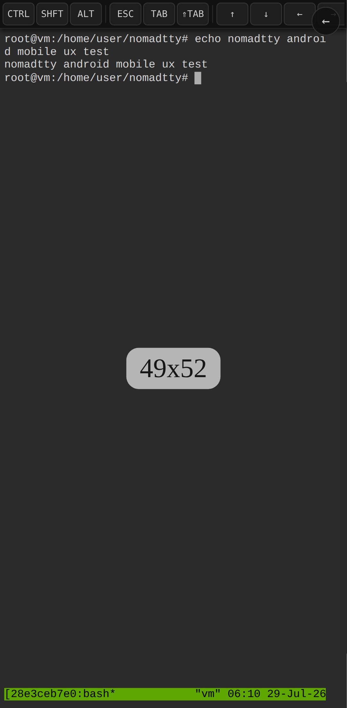 | 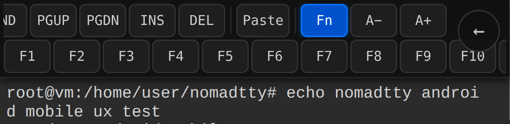 |

Writing tests for these specific mobile interaction patterns — not just
taking a screenshot and eyeballing it — surfaced three real, previously
undiscovered bugs, all now fixed:

1. **The canvas xterm.js renderer drew glyphs at the wrong size at real
   mobile DPR** (only ~20 characters visible where 48+ should fit). Default
   renderer changed to `dom`, the only one of the three verified correct both
   headless and at real mobile DPR. See `docs/ai/mistakes.md` 2026-07-29-014.
2. **The CTRL/SHFT/ALT toolbar buttons double-sent keystrokes**: tapping
   CTRL then pressing a key sent both the intercepted control byte *and* the
   raw, unmodified character, because the intercept never called
   `stopPropagation()`. Fixed in `src/kb.js`. See mistakes.md 2026-07-29-016.
3. **The floating Back button could fully cover the toolbar's own "A+"
   button** when the toolbar row was scrolled all the way right — an
   ordinary swipe gesture. Fixed by reserving scroll padding in `src/kb.js`
   so the row can't scroll far enough to tuck a button under the Back
   button. See mistakes.md 2026-07-29-017.

| Toolbar scrolled to the end — before the fix | Toolbar scrolled to the end — after the fix |
|---|---|
| 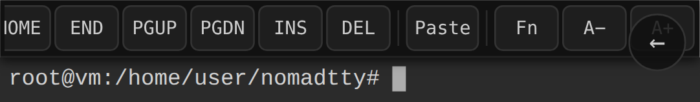 | 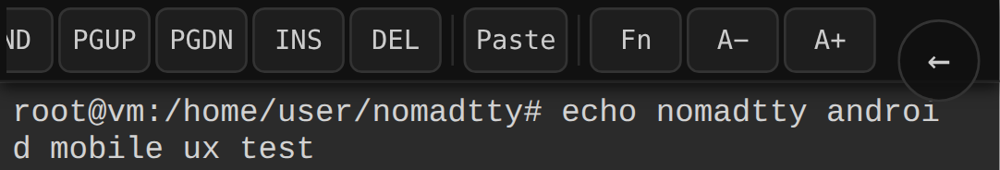 |

### Concurrent-interaction stress testing

Beyond static rendering, `tests/specs/android-mobile-stress.spec.js` (14 tests) validates
the terminal under realistic *concurrent* mobile interaction — typing, scrolling,
rotating the device, and toggling the on-screen keyboard, all while a long-running
foreground process is actively streaming output, the exact condition of chatting with
an AI CLI on a phone. Rather than downloading a local model, these tests drive
`scripts/simulate-model-stream.mjs` — a small deterministic script that writes wrapping
prose to stdout word-by-word with a real per-word delay, producing the same "small
chunks arriving continuously over real time" traffic pattern a live model would,
without the network dependency, cost, or non-determinism of a real API call on every
test run. (One manual spot-check against the `claude` CLI confirmed the traffic-pattern
theory and, interestingly, found `claude -p` doesn't incrementally stream to a
non-interactive terminal at all — it prints nothing for several seconds, then dumps its
whole response at once — see `docs/ai/decision-log.md`.)

Base scenarios: scrolling and typing during an active stream, device rotation
(portrait → landscape → portrait) with the on-screen keyboard held "open", rapid Fn-row
and zoom toggling mid-stream, CTRL+C interrupting a stream via the toolbar, and tapping
Back mid-stream then re-Joining to confirm the stream completed cleanly server-side
(tmux keeps running after the browser tab navigates away).

On top of that, a dedicated block of **6 on-screen-keyboard-toggle-during-active-generation**
scenarios, each pairing a keyboard open/close reflow with a distinct concurrent condition:

1. Rapid repeated open/close cycles throughout an active stream.
2. Typing that lands correctly right as the keyboard opens mid-stream (mid-transition,
   not after waiting for it to settle).
3. Opening the keyboard while the Fn row is *also* expanded mid-stream — two independent
   reflow triggers competing for vertical space at once.
4. Opening the keyboard while zoomed in mid-stream.
5. A scroll gesture while the keyboard is open mid-stream — confirms the (now-disabled,
   see below) scroll gesture stays a safe no-op even stacked with a keyboard reflow.
6. Tapping Back while the keyboard is open mid-stream, then re-Joining — confirms the
   Session Manager itself still renders usably in a reduced/transitioning viewport, and
   the stream (running server-side regardless of the browser tab) completed cleanly.

Two more tests were added to `android-mobile-ux.spec.js` specifically for touch-target
precision and on-screen-keyboard reflow outside of an active stream: a touch-drag-vs-tap
regression test, and an exhaustive keyboard-toggle test (10 open/close cycles back to
back).

| Rotated to landscape, keyboard "open", mid-stream | Fn row expanded mid-stream | Zoomed in mid-stream | On-screen keyboard "open" reflow |
|---|---|---|---|
| 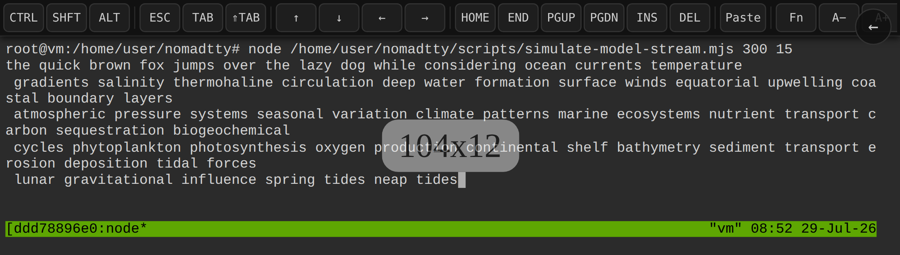 | 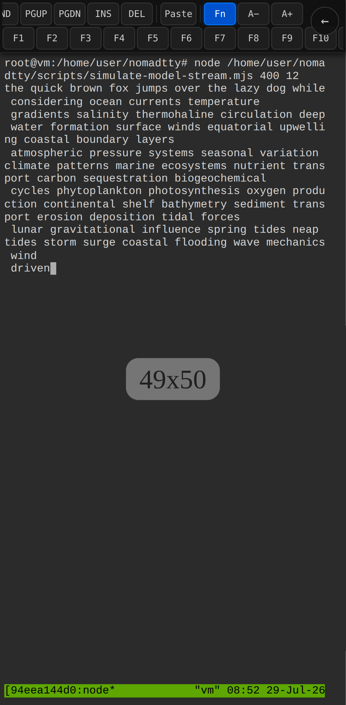 | 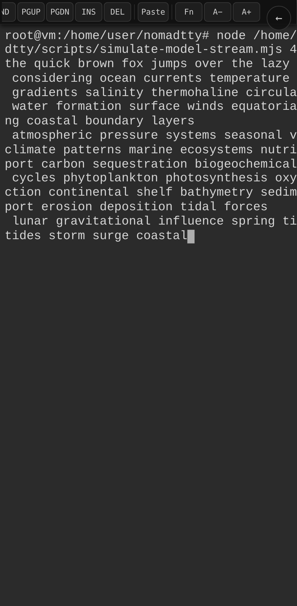 | 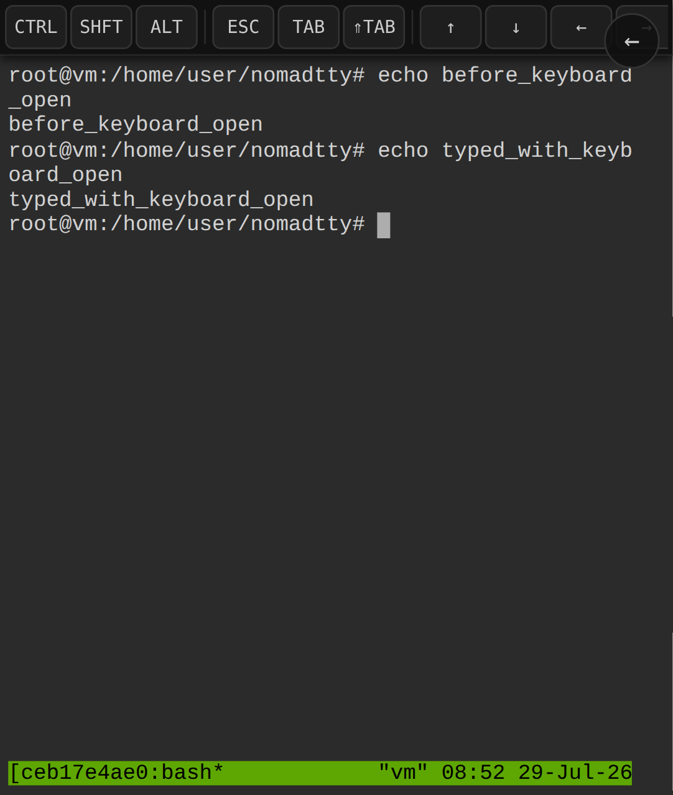 |

This testing found two more real, previously-undiscovered bugs, both now fixed:

1. **Touch-scrolling the terminal could spam literal `^[[A` (Up-arrow key) garbage into
   visible output.** Every NomadTTY session runs inside tmux, which manages pane
   history entirely server-side and never populates xterm.js's own client-side
   scrollback buffer — confirmed directly (`window.term.buffer.active.length` never
   grows past the row count no matter how much output streams through). With zero
   client-side scrollback ever available, *every* touch-scroll gesture hit xterm.js's
   own fallback for "nothing left to scroll": sending real Up/Down-arrow key escape
   sequences to the PTY as client input. If the foreground process isn't reading stdin
   (like a streaming AI reply), the tty's own local echo prints those bytes straight
   back as repeated garbage text mixed into live output. Fixed by disabling the
   touch-scroll gesture entirely (it never provided real functionality here in the
   first place) — scrollback remains fully available via the MCP `scroll_buffer` tool,
   which reads tmux's own history correctly and is unaffected. See mistakes.md
   2026-07-29-018 and decision-log.md for the full investigation.
2. **Toolbar buttons fired on a drag, not just a tap.** A touch that started on a
   button (e.g. CTRL) and dragged 150px sideways before lifting — exactly what
   swiping the toolbar's scrollable row to see more buttons feels like — still
   registered as a press. Fixed with a capture-phase gesture-distance guard on `#kb`:
   drags past a small threshold no longer reach any button's handler, while a
   genuine, near-stationary tap (even with a few pixels of natural finger jitter)
   still works exactly as before. See mistakes.md 2026-07-29-019.

| Screen distortion — before the fix | Clean, distortion-free — after the fix |
|---|---|
| 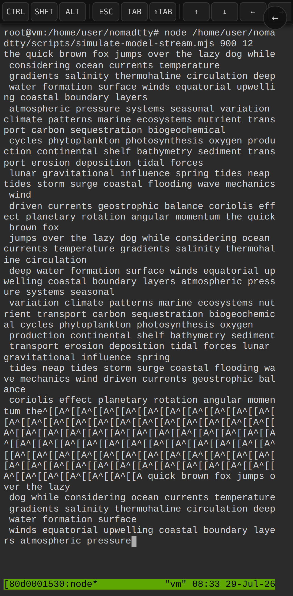 | 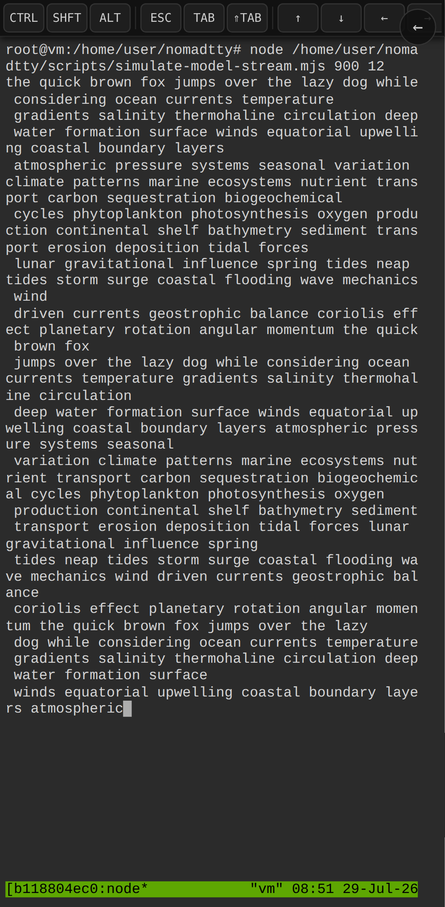 |

### Quick start

```bash
npm install
MCP_AUTH_TOKEN=$(openssl rand -hex 32) node server/main.js
```

This starts two listeners in one process:

| Listener | Default bind | Purpose |
|---|---|---|
| Session Manager | `127.0.0.1:4000` | Multi-session UI/API + terminal reverse proxy (no auth — loopback only) |
| MCP server | `0.0.0.0:4200` | Terminal-control tools for AI agents (bearer-token auth **required**) |

The MCP server refuses to start bound to a non-loopback address without
`MCP_AUTH_TOKEN` set (set `MCP_ALLOW_INSECURE=1` to explicitly override for local
testing — never in production). See `.claude/rules/config.md` for the full list of
`MCP_*` / `SESSION_MANAGER_*` / `TTYD_BASE_PORT` / `TTYD_RENDERER_TYPE` environment
variables.

### Connecting an MCP client

```bash
curl -X POST http://<host>:4200/mcp \
  -H "Authorization: Bearer $MCP_AUTH_TOKEN" \
  -H "Content-Type: application/json" \
  -H "Accept: application/json, text/event-stream" \
  -d '{"jsonrpc":"2.0","id":1,"method":"initialize","params":{"protocolVersion":"2025-03-26","capabilities":{},"clientInfo":{"name":"my-agent","version":"1.0"}}}'
```

The response includes an `Mcp-Session-Id` header; pass it back as the
`Mcp-Session-Id` header on subsequent `tools/list` / `tools/call` requests to the same
`/mcp` endpoint. A minimal, dependency-free reference client that runs this full
handshake plus a `type_command` → `get_screenshot` round trip lives at
`scripts/verify-mcp-agent.mjs`.

### MCP tools

Every terminal-control tool takes a `terminal_id` — the 12-hex-character id returned
by `POST /api/sessions` (or shown in the Session Manager UI). Input schemas below were
diffed against a live server's `tools/list` response and match field-for-field (only
the boilerplate `$schema` line and JSON Schema's numeric-safety `maximum` bound on
integers are omitted here as noise) — not hand-transcribed from memory.

<details>
<summary><code>get_screenshot</code> — capture a terminal's current visual state</summary>

NomadTTY's terminals are text-mode (ttyd/tmux), so this returns an ANSI/text capture
of the viewport rather than a pixel image — there's no server-side pixel renderer in
this architecture (see `docs/ai/decision-log.md`).

```json
{
  "type": "object",
  "properties": {
    "terminal_id": { "type": "string", "description": "The session id, as returned by the Session Manager (12 hex chars)." },
    "ansi": { "type": "boolean", "default": false, "description": "Include ANSI escape codes (colors/styles) in the output." }
  },
  "required": ["terminal_id"]
}
```

Example call and response:
```json
// tools/call params: {"name":"get_screenshot","arguments":{"terminal_id":"91d34864c2ca"}}
{
  "terminal_id": "91d34864c2ca",
  "format": "text",
  "width": 80,
  "height": 24,
  "scroll_offset": 0,
  "content": "root@vm:/home/user/nomadtty# echo readme_example\nreadme_example\nroot@vm:/home/user/nomadtty#\n"
}
```
</details>

<details>
<summary><code>scroll_buffer</code> — scroll a terminal's view up/down</summary>

Position is tracked per `terminal_id` and persists across calls; `"up"` moves further
into scrollback history, `"down"` moves back toward the live view.

```json
{
  "type": "object",
  "properties": {
    "terminal_id": { "type": "string", "description": "The session id to scroll." },
    "direction": { "type": "string", "enum": ["up", "down"], "description": "\"up\" moves further into scrollback history; \"down\" moves toward the live view." },
    "degree": {
      "type": "object",
      "properties": {
        "unit": { "type": "string", "enum": ["lines", "pages"], "description": "Scroll by raw line count or by whole viewport pages." },
        "amount": { "type": "integer", "exclusiveMinimum": 0, "description": "How many lines/pages to scroll." }
      },
      "required": ["unit", "amount"]
    },
    "ansi": { "type": "boolean", "default": false }
  },
  "required": ["terminal_id", "direction", "degree"]
}
```

Example call and response (scrolling up one full page):
```json
// tools/call params: {"name":"scroll_buffer","arguments":{"terminal_id":"91d34864c2ca","direction":"up","degree":{"unit":"pages","amount":1}}}
{
  "terminal_id": "91d34864c2ca",
  "scroll_offset": 24,
  "at_top": false,
  "at_bottom": false,
  "width": 80,
  "height": 24,
  "content": "54\n55\n56\n57\n...\n"
}
```
</details>

<details>
<summary><code>type_command</code> — inject text into a terminal's stdin</summary>

Grants the same power as typing at the terminal directly — see
[Security model](#security-model).

```json
{
  "type": "object",
  "properties": {
    "terminal_id": { "type": "string", "description": "The session id to type into." },
    "text": { "type": "string", "description": "The literal text to inject (e.g. \"echo hello\")." },
    "submit": { "type": "boolean", "default": true, "description": "Send Enter after the text to submit it." }
  },
  "required": ["terminal_id", "text"]
}
```

Example call and response:
```json
// tools/call params: {"name":"type_command","arguments":{"terminal_id":"91d34864c2ca","text":"echo readme_example"}}
{ "terminal_id": "91d34864c2ca", "injected": "echo readme_example", "submitted": true }
```
</details>

<details>
<summary><code>send_keystroke</code> — send a control key or raw hex bytes</summary>

`mode="named"` uses tmux key notation (`"C-c"` for Ctrl+C, `"M-F4"` for Alt+F4,
`"Enter"`, `"Escape"`, `"Up"`, …); `mode="hex"` sends raw two-digit hex-encoded bytes
(`["1b","5b","41"]` for an escape sequence). Named keys are restricted to an explicit
allowlist grammar so a value can't be misread as a tmux CLI flag.

```json
{
  "type": "object",
  "properties": {
    "terminal_id": { "type": "string", "description": "The session id to send the keystroke to." },
    "mode": { "type": "string", "enum": ["named", "hex"], "description": "\"named\" for tmux key notation, \"hex\" for raw hex-encoded bytes." },
    "keys": { "type": "array", "items": { "type": "string" }, "description": "Required when mode=\"named\": e.g. [\"C-c\"], [\"M-F4\"], [\"Enter\"]." },
    "hex": { "type": "array", "items": { "type": "string" }, "description": "Required when mode=\"hex\": two-digit hex bytes, e.g. [\"1b\",\"5b\",\"41\"]." }
  },
  "required": ["terminal_id", "mode"]
}
```

Example call and response (Ctrl+C):
```json
// tools/call params: {"name":"send_keystroke","arguments":{"terminal_id":"91d34864c2ca","mode":"named","keys":["C-c"]}}
{ "terminal_id": "91d34864c2ca", "mode": "named", "keys": ["C-c"] }
```
</details>

<details>
<summary><code>read_terminal_contents</code> — read the stdout buffer (full / head / tail / live-follow)</summary>

`mode="tail"` (default) returns the most recent `lines` lines — efficient for
polling recent output. `mode="head"` returns the oldest `lines` lines of scrollback.
`mode="full"` returns everything, capped (see `MCP_MAX_CAPTURE_LINES`) and flagged via
`truncated` if the cap was hit. Set `follow=true` **and** a `progressToken` in the
request's `_meta` to stream new output live as `notifications/progress` SSE events for
up to `MCP_FOLLOW_MAX_SECONDS` — this is the tool's real-time streaming mode.

```json
{
  "type": "object",
  "properties": {
    "terminal_id": { "type": "string", "description": "The session id to read from." },
    "mode": { "type": "string", "enum": ["full", "head", "tail"], "default": "tail" },
    "lines": { "type": "integer", "exclusiveMinimum": 0, "description": "Line count for mode=\"head\"/\"tail\" (default 200)." },
    "ansi": { "type": "boolean", "default": false, "description": "Include ANSI escape codes in the output." },
    "follow": { "type": "boolean", "default": false, "description": "Stream new output as it arrives via progress notifications (requires the caller to set a progressToken)." }
  },
  "required": ["terminal_id"]
}
```

Example call and response:
```json
// tools/call params: {"name":"read_terminal_contents","arguments":{"terminal_id":"91d34864c2ca","mode":"tail","lines":5}}
{
  "terminal_id": "91d34864c2ca",
  "mode": "tail",
  "ansi": false,
  "content": "root@vm:/home/user/nomadtty# echo readme_example\nreadme_example\nroot@vm:/home/user/nomadtty#\n"
}
```
</details>

<details>
<summary><code>get_process_status</code> — process tree running inside a terminal's shell</summary>

Returns the pane's shell PID and every descendant process, with CPU%, memory%,
elapsed time, and state — useful for checking whether a command an agent started is
still running, hung, or has exited.

```json
{
  "type": "object",
  "properties": {
    "terminal_id": { "type": "string", "description": "The session id to inspect." }
  },
  "required": ["terminal_id"]
}
```

Example call and response:
```json
// tools/call params: {"name":"get_process_status","arguments":{"terminal_id":"91d34864c2ca"}}
{
  "terminal_id": "91d34864c2ca",
  "shell_pid": 29035,
  "processes": [
    { "pid": 29035, "ppid": 29034, "cpuPercent": 0.2, "memPercent": 0, "elapsed": "00:11", "state": "Ss+", "command": "bash" }
  ]
}
```
</details>

<details>
<summary><code>list_active_ports</code> — host-wide TCP/UDP listening sockets</summary>

Useful for confirming a dev server an agent just started is actually listening, or
checking for a port conflict before starting one. Reflects the whole host, not one
terminal in isolation, since NomadTTY sessions share the host network namespace.

```json
{
  "type": "object",
  "properties": {
    "protocol": { "type": "string", "enum": ["tcp", "udp", "all"], "default": "all" }
  }
}
```

Example call and response:
```json
// tools/call params: {"name":"list_active_ports","arguments":{"protocol":"tcp"}}
{
  "protocol": "tcp",
  "count": 8,
  "ports": [
    { "protocol": "tcp", "localAddress": "0.0.0.0", "localPort": 4200, "process": "node", "pid": 28298 }
  ]
}
```
</details>

### Security model

`type_command`/`send_keystroke` grant the same power as typing at the terminal
directly — command content is not, and cannot usefully be, sandboxed without
defeating the tool's purpose. The security boundary is authentication and network
exposure, per [`AGENTS.md`](AGENTS.md)'s non-negotiable rule that ttyd itself never
listens on anything but `127.0.0.1`:
- ttyd processes spawned by the Session Manager are **always** `127.0.0.1`-only and
  `--writable`, exactly like the legacy model — only the separate MCP listener is
  LAN-facing.
- A bearer token (`MCP_AUTH_TOKEN`) is required for any non-loopback MCP bind.
- `type_command` runs a best-effort denylist of obviously destructive one-liners
  (`rm -rf /`, fork bombs, `mkfs`, …) as defense-in-depth — not a sandbox, and
  disableable via `MCP_DENYLIST_ENABLED=0` if it produces a false positive.
- Only give `MCP_AUTH_TOKEN` to agents you'd trust with a real shell on this host.

---

## The VirtualKeyBar

Executing complex terminal commands on mobile devices is painful because software
keyboards lack essential modifier keys. NomadTTY's toolbar solves this with
**sticky modifier keys**.

To send a `SIGINT` (`Ctrl+C`):

1. Tap **CTRL** — the button highlights blue and latches active.
2. Type `C` on your phone keyboard.

The toolbar intercepts the keydown event, calculates the correct ASCII control byte,
and transmits it to the PTY:

```javascript
// Physical keydown interceptor in src/kb.js
document.addEventListener('keydown', function (ev) {
  if (!M.c && !M.s && !M.a) return;   // no modifier active — pass through
  var k = ev.key;
  ev.preventDefault();
  if (M.c && k.length === 1) {
    var code = k.toUpperCase().charCodeAt(0) - 64;  // 'C' → 67 − 64 = 3
    if (code > 0 && code < 32) send(String.fromCharCode(code));  // sends \x03
  }
  resetMods();
}, true);
```

The same mechanism handles ALT (sends ESC prefix) and SHIFT (uppercases), and all
three can be active simultaneously for combinations like `Ctrl+Shift+Up`.

---

## Security Posture

NomadTTY is designed for **private network deployment**, not public internet exposure.

| Layer | Mechanism |
|-------|-----------|
| **ttyd isolation** | Binds to `127.0.0.1:47821` only — unreachable from outside the server |
| **nginx as gateway** | The only public-facing process; enforces TLS, rate limits, auth |
| **No built-in auth** | Your responsibility — Tailscale VPN is the recommended approach |
| **Non-root service** | ttyd runs as the deploy user, not root |
| **Sub-filter injection** | Inline hook is < 300 B; full toolbar in external `kb.js` |
| **Dependabot scanning** | Automated CVE checks on Docker base and GitHub Actions pins |

**Recommended deployment:** put NomadTTY behind [Tailscale](https://tailscale.com) so
the terminal is never reachable from the public internet. Tailscale Serve adds
automatic HTTPS on your `ts.net` domain.

See [SECURITY.md](SECURITY.md) for the full hardening checklist and vulnerability
disclosure process.

---

## Keyboard Toolbar Reference

| Key | What it sends |
|-----|--------------|
| **CTRL** | Sticky modifier — tap then press a letter for Ctrl+letter |
| **SHFT** | Sticky shift modifier |
| **ALT** | Sticky alt modifier — sends ESC prefix |
| **ESC** | `\x1b` |
| **TAB** | `\t` |
| **⇑TAB** | Shift+Tab `\x1b[Z` |
| **↑↓←→** | Arrow keys (with modifier support: Ctrl+↑, Shift+↑, etc.) |
| **HOME / END** | `\x1b[H` / `\x1b[F` |
| **PGUP / PGDN** | `\x1b[5~` / `\x1b[6~` |
| **INS / DEL** | `\x1b[2~` / `\x1b[3~` |
| **Paste** | Clipboard API (HTTPS) or overlay textarea (HTTP) |
| **Fn** | Toggle F1–F12 row |
| **F1–F12** | Standard xterm sequences |
| **A− / A+** | Zoom terminal text in/out |

---

## Tailscale Setup

To expose NomadTTY only on your Tailscale network (no public internet):

```bash
# Option 1: Tailscale Serve — automatic HTTPS on your ts.net domain
tailscale serve --bg http://localhost:80

# Option 2: Point a DNS record at your Tailscale IP and set server_name
NOMADTTY_HOST=terminal.yourdomain.com sudo -E bash -c \
  'curl -fsSL https://raw.githubusercontent.com/shifulegend/nomadtty/main/install.sh | bash'
```

---

## Contributing

See [CONTRIBUTING.md](CONTRIBUTING.md) for coding standards, branch naming
conventions, and pull request requirements.

Security issues go through [SECURITY.md](SECURITY.md) — please use private advisories,
not public issues.

For help, see [SUPPORT.md](SUPPORT.md).

---

## License

NomadTTY itself is MIT licensed. See [LICENSE](LICENSE).

Third-party components (ttyd, xterm.js, tmux, nginx) are credited in [NOTICE](NOTICE).
